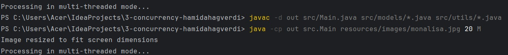

# Task 3 - Concurrency
This high-performance Java application demonstrates concurrent processing capabilities by implementing image manipulation tasks in both single and multi-threaded environments. The core functionality divides input images into configurable square blocks, computes the average color within each block through pixel analysis, and applies these averaged colors to create a processed output. What sets this application apart is its dual-mode processing approach: a single-threaded mode that sequentially processes the image blocks from top to bottom, and a multi-threaded mode that leverages parallel processing to handle multiple image sections simultaneously. Throughout the processing, users benefit from real-time visual feedback through an adaptive GUI display that automatically scales to accommodate various image dimensions. This implementation not only serves as a practical demonstration of concurrent programming principles but also provides insights into the performance benefits of parallel processing in computationally intensive tasks.

## Features

Performance & Processing
- Single-threaded (S): Sequential, memory-efficient processing
- Multi-threaded (M): Parallel processing utilizing all CPU cores

Smart Image Handling
- Automatic screen-size adaptation
- Real-time preview of processing effects
- Support for various image formats (JPG, PNG)
- Customizable square size for pixel averaging

## Project Structure
```
src/
├── Main.java                 # Application entry point
├── models/
│   └── ImageProcessor.java   # Core processing logic
└── utils/
    ├── DisplayUtils.java     # GUI handling
    ├── ImageUtils.java       # Image operations
    ├── LoggerUtils.java      # Logging system
    └── ThreadUtils.java      # Thread management
```

## Components

1. [Main](https://github.com/ADA-GWU/3-concurrency-hamidahagverdi/blob/main/src/Main.java) class - core application flow:

    1. **_Input Handling_**:
         -  Validates 3 arguments: _filename_, _square size_, _mode (S/M)_.
         -  Loads image using _ImageUtils_.

    2. **_Screen Adaptation_**:
        -  Checks if image bigger than screen.
        -  Resizes if needed while maintaining aspect ratio.

    3. **_Display Setup_**:
        -  Creates GUI window.
        -  Shows initial image.

    4. **_Processing_**:
        -  _Single-thread (S)_: Processes full image in one thread.
        -  _Multi-thread (M)_: Divides image for parallel processing.
        -  Uses _ImageProcessor_ for actual processing.

    5. **_Error Handling_**:
        -  Catches exceptions.
        -  Logs errors.
        -  Shows user-friendly messages.

** Acts as program entry point, coordinates all components and manages workflow.

2. [ImageProcessor](https://github.com/ADA-GWU/3-concurrency-hamidahagverdi/blob/main/src/models/ImageProcessor.java) class handles the core image processing:

    1. Takes an image section (defined by startY to endY)
    2. Processes image in square blocks
        For each block:
        -  Calculates average color
        -  Fills block with that color
        -  Saves progress
        -  Updates display

** Implements Runnable for multi-threading support

Key parameters:

- **image**: Image to process
- **label**: GUI display element
- **squareSize**: Block size
- **startY/endY**: Section boundaries

3. [DisplayUtils](https://github.com/ADA-GWU/3-concurrency-hamidahagverdi/blob/main/src/utils/DisplayUtils.java) handles the GUI display:
    1. Scales image
    2. Updates GUI
    3. Triggers repaint
       
    - **_getScaledDimension_**: Calculates image size to fit screen (80% of screen size)
    - **_createMainFrame_**: Creates window with proper layout & border
    - **_updateDisplay_**: Updates display with current processing state:

**Provides real-time visual feedback of image processing

4. [ImageUtils](https://github.com/ADA-GWU/3-concurrency-hamidahagverdi/blob/main/src/utils/ImageUtils.java) provides core image handling functions:
    1. Takes coordinates and size
    2. Sums R,G,B values
    3. Returns average color for that block
       
    - **_loadImage_**: Reads image file from disk
    - **_saveImage_**: Saves processed image as JPG
    - **_calculateAverageColor_**: Calculates average RGB color within a square region:

**Handles image I/O and color calculations for the pixel averaging process.

5. [LoggerUtils](https://github.com/ADA-GWU/3-concurrency-hamidahagverdi/blob/main/src/utils/LoggerUtils.java) provides error logging functionality:

    1. Creates and configures a logger to write to _"imageprocessor.log"_
    2.  Uses FileHandler for file output
    3. Formats log entries with SimpleFormatter
    4. Offers static _getLogger()_ method for accessing logger throughout application
**Centralizes error tracking and debugging information.

6. [ThreadUtils](https://github.com/ADA-GWU/3-concurrency-hamidahagverdi/blob/main/src/utils/ThreadUtils.java) manages multi-threaded image processing:

    1. Gets number of available CPU cores
    2. Divides image into horizontal sections based on core count
    3. Creates thread for each section
    4. Each thread processes its section independently using _ImageProcessor_
**Enables parallel processing for faster image manipulation.

## Requirements for running

1. Java Development Kit (JDK) 8 or higher.
2. Make sure Java is properly installed and added to system PATH (so you can run `java` and `javac` commands from terminal).
3. Minimum 2GB RAM (recommended).
4. Graphics support for GUI display.

## Installation & Run

1. Clone the repository:
```
# Clone & Navigate
git clone https://github.com/ADA-GWU/3-concurrency-hamidahagverdi.git
cd 3-concurrency-hamidahagverdi
```
2. Compile the Java file:
```
# Compile
mkdir out
javac -d out src/Main.java src/models/*.java src/utils/*.java
```
3. Run the compiled program:
```
#Run
java -cp out src.Main resources/images/monalisa.jpg 20 M
```

## Processing Modes

### Single-threaded Mode (S)
- Sequential top-to-bottom processing
- Optimal for smaller images
- Consistent memory usage
- Predictable processing pattern

### Multi-threaded Mode (M)
- Parallel processing across CPU cores
- Faster processing for larger images
- Divides image into sections for parallel processing
- Real-time concurrent updates

## Input:
```
- `filename`: Path to your image file (e.g., "image.jpg")
- `square_size`: Size of the averaging square in pixels (e.g., 20)
- `mode`: Processing mode - 'S' for single-threaded or 'M' for multi-threaded
```
- resources/images/monalisa.jpg - Image file path
- 20 - Pixel averaging block size
- S/M - Processing mode: Single-threaded/Multi-threaded Mode

_**Example Input**_:


## Output
- Processed image is saved as "result.jpg" in the working directory
- Live preview is shown in a GUI window
- Processing logs are written to "imageprocessor.log"

### Results

### Before Processing


### After Processing

