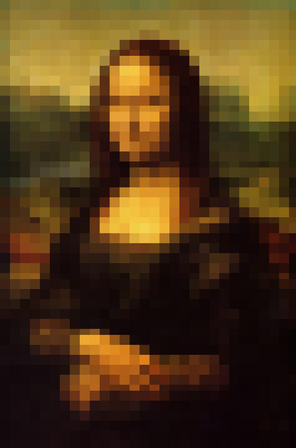

# Concurrency
A high-performance Java application for image processing using pixel averaging effects, featuring both single and multi-threaded processing with real-time visualization.

## Features

Performance & Processing
- Single-threaded (S): Sequential, memory-efficient processing
- Multi-threaded (M): Parallel processing utilizing all CPU cores

Smart Image Handling
- Automatic screen-size adaptation
- Real-time preview of processing effects
- Support for various image formats (JPG, PNG)
- Customizable square size for pixel averaging

## Requirements

- Java Development Kit (JDK) 8 or higher
- Minimum 2GB RAM (recommended)
- Graphics support for GUI display

## Project Structure
```
src/
├── Main.java                 # Application entry point
├── models/
│   └── ImageProcessor.java   # Core processing logic
└── utils/
    ├── DisplayUtils.java     # GUI handling
    ├── ImageUtils.java       # Image operations
    ├── LoggerUtils.java      # Logging system
    └── ThreadUtils.java      # Thread management
```

## Components

1. [Main](https://github.com/ADA-GWU/3-concurrency-hamidahagverdi/blob/main/src/Main.java) class - core application flow:

    1. Input Handling:
        - Validates 3 arguments: filename, square size, mode (S/M)
        - Loads image using ImageUtils

    2. Screen Adaptation:
    - Checks if image bigger than screen
    - Resizes if needed while maintaining aspect ratio

3. Display Setup:
- Creates GUI window
- Shows initial image

4. Processing:
- Single-thread (S): Processes full image in one thread
- Multi-thread (M): Divides image for parallel processing
- Uses ImageProcessor for actual processing

5. Error Handling:
- Catches exceptions
- Logs errors
- Shows user-friendly messages

Acts as program entry point, coordinates all components and manages workflow.

2. [ImageProcessor](https://github.com/ADA-GWU/3-concurrency-hamidahagverdi/blob/main/src/models/ImageProcessor.java) class handles the core image processing:

- Takes an image section (defined by startY to endY)
- Processes image in square blocks
For each block:
- Calculates average color
- Fills block with that color
- Saves progress
- Updates display

Implements Runnable for multi-threading support

Key parameters:

1. image: Image to process
2. label: GUI display element
3. squareSize: Block size
4. startY/endY: Section boundaries

3. [DisplayUtils](https://github.com/ADA-GWU/3-concurrency-hamidahagverdi/blob/main/src/utils/DisplayUtils.java) handles the GUI display:
 
- getScaledDimension: Calculates image size to fit screen (80% of screen size)
- createMainFrame: Creates window with proper layout & border
- updateDisplay: Updates display with current processing state:

1. Scales image
2. Updates GUI
3. Triggers repaint
Provides real-time visual feedback of image processing

4. [ImageUtils](https://github.com/ADA-GWU/3-concurrency-hamidahagverdi/blob/main/src/utils/ImageUtils.java) provides core image handling functions:

- loadImage: Reads image file from disk
- saveImage: Saves processed image as JPG
- calculateAverageColor: Calculates average RGB color within a square region:

1. Takes coordinates and size
2. Sums R,G,B values
3. Returns average color for that block
Handles image I/O and color calculations for the pixel averaging process.

5. [LoggerUtils](https://github.com/ADA-GWU/3-concurrency-hamidahagverdi/blob/main/src/utils/LoggerUtils.java) provides error logging functionality:

- Creates and configures a logger to write to "imageprocessor.log"
- Uses FileHandler for file output
- Formats log entries with SimpleFormatter
- Offers static getLogger() method for accessing logger throughout application
Centralizes error tracking and debugging information.

6. [ThreadUtils](https://github.com/ADA-GWU/3-concurrency-hamidahagverdi/blob/main/src/utils/ThreadUtils.java) manages multi-threaded image processing:

1. Gets number of available CPU cores
2. Divides image into horizontal sections based on core count
3. Creates thread for each section
4. Each thread processes its section independently using ImageProcessor
Enables parallel processing for faster image manipulation.

**Example calculation:
With 4 cores and 1000px height:
Thread 1: 0-250px
Thread 2: 250-500px
Thread 3: 500-750px
Thread 4: 750-1000px

## Installation

1. Clone the repository:
```
# Clone & Navigate
git clone https://github.com/ADA-GWU/3-concurrency-hamidahagverdi.git
cd 3-concurrency-hamidahagverdi
```
2. Compile the Java file:
```
# Compile
mkdir out
javac -d out src/Main.java src/models/*.java src/utils/*.java
```
3. Run the compiled program:
```
#Run
java -cp out src.Main resources/images/monalisa.jpg 20 M
```
## Input

Parameters:
- `filename`: Path to your image file (e.g., "image.jpg")
- `square_size`: Size of the averaging square in pixels (e.g., 20)
- `mode`: Processing mode - 'S' for single-threaded or 'M' for multi-threaded

Example input:
```
resources/images/monalisa.jpg 20 S
resources/images/monalisa.jpg 20 M
```
- resources/images/monalisa.jpg - Image file path
- 20 - Pixel averaging block size
- S/M - Processing mode: Single-threaded/Multi-threaded Mode

## Output

- Processed image is saved as "result.jpg" in the working directory
- Live preview is shown in a GUI window
- Processing logs are written to "imageprocessor.log"

## Processing Modes

### Single-threaded Mode (S)
- Sequential top-to-bottom processing
- Optimal for smaller images
- Consistent memory usage
- Predictable processing pattern

### Multi-threaded Mode (M)
- Parallel processing across CPU cores
- Faster processing for larger images
- Divides image into sections for parallel processing
- Real-time concurrent updates

### Results

### Before Processing


### After Processing

